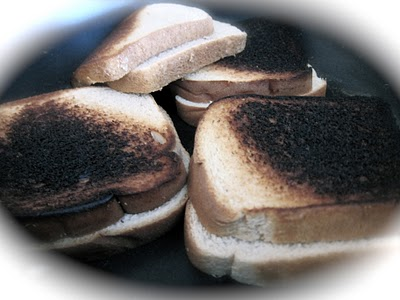

<!SLIDE >
# What is Programming? #

<!SLIDE bullets incremental>
# Programming #
* The action or process of writing computer programs.
* Predetermined behavior.

.notes These are really bad definitions, I snagged them from Google's dictionary while trying to find a good way of explaining what programming was. Let's try again shall we? 

<!SLIDE bullets incremental transition=toss>
# Programming
* Programming is writing a program?
* Programming is writing code?

.notes Well, that's less than useless, maybe let's try another? Nope! still useless. Guess we're not asking the right question. 

<!SLIDE bullets incremental transition=toss>
# Why Program Stuff?
* To make it do something cool/useful
* Automate tasks

<!SLIDE bullets>
# That's Better! 
* Programming - telling a computer how to do something 

<!SLIDE bullets>
# How Do We Do It
* It's like writing a recipe

<!SLIDE bullets incremental>
# Steps
* Declare Your Ingredients
* Follow Directions
* Clean Up

<!SLIDE bullets incremental>
# Grilled Cheese - Ingredients
* 2 Slices of Bread
* Butter
* Cheese
* Tomato

.notes Normally I don't like tomato on my grilled cheese but for this example I needed to make an exception. 

<!SLIDE small>
# Grilled Cheese - Directions

1. Slice cheese into thin slices
2. Slice tomato 
3. Apply butter to bread
4. Place cheese and tomato on bread
5. Place all of that in your pan
6. Heat until cheese is melted

.notes Ok, so we have our recipe. Cool, what happens next? 

<!SLIDE center>
# Ooops

<!SLIDE bullets incremental>
# What happened
* Instructions were ambiguous
* Instructions were incomplete

.notes How much tomato or cheese, how much butter. How do I place it in the pan? With a person you can count on some common sense but with a computer it follows what you say exactly. Notice how I never said to remove from the pan? Or place the pan on the stove? I also never told it what a pan or a stove was. I didn't say how to heat it. I'm going to skip the cleanup step because I've made my point. 

<!SLIDE small bullets incremental>
# Takeaways

* Computers are kinda dumb
* Programs must be explicit
* Andrew eats a lot of Ramen noodles

.notes Assume that a computer is dense, really really dense. So, how can we be explicit and explain to them completely what to do in a concise manner? Also, I really don't eat Ramen noodles, they're really bad for you... too much sodium.

<!SLIDE incremental bullets>
# Programming Languages
* Typically human readable languages that can 'easily' be converted to machine readable instructions

<!SLIDE smaller> 
# What do they look like?
	@@@cpp
	int factorial(int x) {
		  if (x == 1) 
		  	return x; 
		  else 
		  	return x * factorial(x - 1);
		}
.notes Well, that looks ugly and confusing doesn't it? Well, what is it actually saying. 

<!SLIDE smaller incremental>
# Translation
* There's a function called _factorial_
* It maps its input (an integer that we just named _x_) to another integer
* Everything inside the braces is just how it maps it

<!SLIDE smaller incremental>
# A brief aside about mathematics
* This is all math
* A function is just something that takes inputs and produces an output
* We can denote this as f(x) => y
* __IMPORTANT__ if f(1) => 4 it should always map to 4. 

<!SLIDE smaller incremental>
# Math and Programming
* Almost anything that applies in math applies here too
* f(g(x)) is completely valid
* a = f(x) assigns whatever f(x) is to _a_
* b = f(x)*g(y) 
* You get the point... 

<!SLIDE bullets incremental>
# Core Concepts
* Variables
* Conditionals
* Loops

<!SLIDE bullets incremental>
# Variables
* Store _something_
* Store a reference to something
* Interestingly, not required in a _complete_ language...

<!SLIDE bullets incremental>
# Variables - How Work?
* Computer memory is a big array of values
* Stuff is stored in them
* A variable stores where those values are stored

<!SLIDE bullets incremental>
# Conditionals
* Do something when a condition is met
* All conditions are either true of false
* Typically - >, <, ==, <=, >=, or !

<!SLIDE bullets incremental>
# Conditionals - What Do?
* if __SOMETHING__ do __THING__
* ... else do __OTHER THING__

<!SLIDE small bullets incremental>
# A Note About ==
* You noticed = and ==
* They're different
* = sets values
* == tests equality

<!SLIDE small bullets incremental>
# Issues with ==/=
* a == 5 // checks if _a_ is 5
* a = 5 // sets _a_ to 5
* 5 == 6 // checks if 5 is 6
* 5 = 6 // attempts to set 5 equal to 6 
* 5 == a // checks if 5 is equal to _a_
* 5 = a // attempts to set 5 to _a_

<!SLIDE small bullets incremental>
# Loop de Loop! 
* Do something repeatedly
* Do something repeatedly
* Do something repeatedly
* Do something repeatedly
* Do something repeatedly
* Do something repeatedly

<!SLIDE small bullets incremental>
# What is a Loop
* It's a structure that allows you to do something until a condition is met
* Sometimes that condition will never be met
* It saves repeating yourself

<!SLIDE bullets incremental>
# By your powers combined ... 
* I am Captain Program! 

<!SLIDE bullets incremental>
# Tha...tha...tha... that's all folks!
* Arranging these concepts is most of programming
* Technically, you don't need variables
* But variables make life easier

<!SLIDE bullets incremental>
# Writing Good Code
* Good variable names
* Commented
* Clear function names

<!SLIDE small bullets incremental>
# Variable names
* _a_ is a terrible name
* _wheelSpeed_ is a good name
* _i_ is typically used for temporary counters
* Descriptive is key
* Speling, stil important! 

<!SLIDE small bullets incremental>
# Commenting 
* Think 6 months out
* Coming back to code 
* If you ask "What idiot did this this way"
* This is where comments are great

<!SLIDE small bullets incremental>
# Commenting 
* Explain edge cases you checked for
* Explain why an algorithm was chosen
* Explain why a data structure was chosen
* Just explain WHY

<!SLIDE small bullets incremental>
# Self Documenting Code
* "But it's clear what it does!"
* Wrong answer!
* Take the 2 minutes to write up what it does

<!SLIDE small bullets incremental>
# Comment Driven Coding
* Write a comment about what a chunk of code does before writing the code
* Help you figure out what code will do
* Help break up code logically

<!SLIDE small bullets incremental>
# Clear Function Names
* _doSomething_ is a terrible name
* _doIt_ is even worse
* _fibonaci_ is a pretty decent one
* Should be descriptive and concise

<!SLIDE small bullets incremental>
# How to Start
* What do you need to do?
* Draw a picture
* How can it be broken up?
* What do I need to store?
* Start writing code

<!SLIDE small bullets incremental>
# If You're Stuck
* Talk it out
* Refer back to picture
* Take a walk
* Work on something else
* Take a nap

